# CoW Protocol & DAO Ecosystem Analysis
*Analysis Date: October 6, 2025*

## Executive Overview

CoW Protocol is a meta-DEX aggregation protocol that revolutionizes decentralized trading through intent-based orders and fair combinatorial batch auctions. Built by CoW DAO, the protocol protects users from MEV exploitation while finding optimal execution prices across multiple liquidity sources. The core innovation lies in matching "Coincidence of Wants" (CoWs) - directly pairing buyers and sellers within batches before tapping external liquidity from AMMs, aggregators, and private market makers.

CoW DAO operates three flagship products: CoW Protocol for trading, MEV Blocker as an RPC endpoint protecting transactions from MEV attacks, and CoW AMM protecting liquidity providers from Loss-versus-Rebalancing (LVR). The protocol has expanded across multiple chains including Ethereum mainnet, Gnosis Chain, BNB Chain, and Lens Chain, with cross-chain swap capabilities and gasless trading on select networks.

The ecosystem is powered by a competitive solver network where independent solver algorithms compete every few seconds to find optimal order execution paths. Governance is conducted through the COW token (1 billion total supply, 3% max annual inflation), with proposals requiring 10,000+ COW to submit and passing through community discussion and Snapshot voting. The DAO treasury holds 44.4% of tokens and operates a grants program with 600,000 xDAI and 1,465,260 COW (plus 4,990,000 COW for volume grants) running through January 2026. The protocol captures value through surplus fees (50% of surplus capped at 1% order volume) and Gnosis Chain volume fees (10 basis points), redistributing protocol revenue to support ecosystem development and sustainability.

---

## Core Components

### 1. CoW Protocol Smart Contracts

**Purpose**: On-chain settlement layer that executes verified trades atomically

**Mechanism**:
- Settlement contract receives batch solutions from winning solvers
- Validates order signatures using four schemes: EIP-712 (recommended for EOAs), eth_sign, ERC-1271 (for smart contracts), and PreSign (on-chain)
- Executes token transfers atomically using order digests (bytes32) computed via EIP-712 with domain separation for replay protection
- Supports multiple order types with partial fillability options
- Known contracts repository uses Foundry framework with comprehensive testing

**Stakeholders**: Solvers (submit solutions), traders (signed orders executed), DAO (contract governance)

**Connections**: Receives solutions from Autopilot/Driver services, interacts with external DEXs/AMMs for liquidity, validates orders from Orderbook service

---

### 2. Off-Chain Services Architecture

#### Orderbook Service
**Purpose**: Centralized orderbook managing user order submission and querying

**Mechanism**:
- HTTP API for users to add signed orders, query order status, and estimate fees/limit prices
- PostgreSQL database for order persistence and state management
- Validates orders against blockchain conditions before acceptance
- Horizontally scalable with multiple concurrent instances

**Stakeholders**: Traders (submit orders), solvers (query pending orders), integrators (API consumers)

**Connections**: Shares PostgreSQL with Autopilot, exposes data to solver competition, receives order submissions from CoW Swap/Widget/integrations

#### Autopilot
**Purpose**: Protocol driver determining auction boundaries and orchestrating settlements

**Mechanism**:
- Determines which orders to include in each auction batch
- Computes auction boundaries (timing, order grouping)
- Calculates settlement objective values for solver competition
- Coordinates with Driver for solution execution

**Stakeholders**: Protocol operations (automated), solvers (receive auction instances), DAO (governance oversight)

**Connections**: Reads from shared PostgreSQL, communicates with Driver/solver network, triggers settlement contract interactions

#### Driver (Emerging)
**Purpose**: Replacement for legacy solver infrastructure with co-location design

**Mechanism**:
- Handles solver communication and solution submission
- Manages on-chain transaction execution
- Optimizes for performance with co-located architecture

**Stakeholders**: Solvers, protocol infrastructure

**Connections**: Receives instructions from Autopilot, submits winning solutions to Settlement contract

---

### 3. Solver Network

**Purpose**: Competitive algorithmic market makers finding optimal trade execution

**Mechanism**:
- Independent solvers receive auction instances every few seconds
- Each solver computes optimal prices, amounts, and liquidity routing
- Solvers compete using different strategies:
  - Efficient optimization algorithms
  - Identifying easy-to-solve problem instances
  - Incorporating diverse liquidity sources (AMMs, aggregators, private MMs)
  - Integrating external market makers/DEX aggregators
- Protocol selects winner based on objective function maximizing trader surplus
- Winning solver rewarded, their solution executed on-chain
- Performance tracked via Dune Analytics dashboards

**Stakeholders**: Solver operators (run algorithms), traders (benefit from competition), protocol (auction orchestration)

**Connections**: Query Orderbook for pending orders, access external liquidity sources (Uniswap, Sushiswap, Balancer, Curve, 1inch, Paraswap, Matcha), submit solutions to Autopilot/Driver, interact with Settlement contract

**Note**: Batch auction optimization is computationally complex with no perfect algorithm - solver diversity drives innovation

---

### 4. Intent-Based Order System

**Purpose**: Allow users to express desired trade outcomes without specifying execution paths

**Mechanism**:
Orders contain three parameter categories:
1. **Batch Auction Parameters**: tokens to swap, amounts, swap type (buy/sell), partial fillability, protocol fees
2. **Coordination/Settlement Parameters**: receiver address, validity period, token source/destination, balance considerations
3. **Metadata Parameters**: application-specific data

Solvers interpret intents and determine optimal execution paths

**Stakeholders**: Traders (submit intents), solvers (fulfill intents), protocol (validates parameters)

**Connections**: Orders submitted via Orderbook API, processed by Autopilot, executed by Settlement contract

---

### 5. Batch Auction Mechanism

**Purpose**: Fair Combinatorial Auction maximizing trader welfare through batching

**Mechanism**:
- Groups multiple orders into discrete time batches (every few seconds)
- First searches for Coincidence of Wants (CoWs) - direct peer-to-peer matches within batch
- CoWs require no external liquidity, providing best prices and zero slippage
- Remaining unmatched orders routed to external liquidity sources
- Single uniform clearing price per token pair in batch (fairness guarantee)
- Solvers propose complete batch solutions with pricing and routing
- Protocol evaluates solutions using objective function
- Winning solution executed atomically on-chain

**Stakeholders**: All traders in batch (receive uniform pricing), solvers (compete for batch), protocol (orchestrates mechanism)

**Connections**: Powered by Autopilot (auction orchestration), solver network (solution generation), Settlement contract (execution)

---

### 6. CoW DAO Governance

**Purpose**: Decentralized governance framework for protocol evolution

**Mechanism**:

**Governance Process (CIPs - CoW DAO Improvement Proposals):**
- **Phase 1**: Community Discussion (minimum 6 days, 72 hours for fast-track)
  - Draft proposal in Governance forum (forum.cow.fi)
  - Community engagement and feedback
  - Transaction simulations for on-chain proposals
- **Phase 2**: Voting (7 days)
  - Requires 10,000+ COW tokens to propose
  - CIP number assignment
  - Snapshot vote creation (snapshot.org/#/cow.eth)
  - oSnap module for executable transactions (3-day execution delay post-vote)

**Governance Venues:**
- **Forum**: Primary discussion and proposal drafting
- **Snapshot**: Token-weighted voting (vCOW + COW)
- **Discord**: Informal discussion (#governance-discussion channel)

**Governance Principles:**
- "Living document" owned by the CoWmunity
- Emphasis on efficiency and decentralization improvements
- Transparent, adaptable processes

**Stakeholders**: COW/vCOW token holders (voting rights), community contributors (proposals/discussion), core team (development), governance committee (grants oversight)

**Connections**: Governs protocol parameters, treasury allocation, grants program, fee structures, and ecosystem development priorities

---

### 7. COW Token Economics

**Purpose**: Governance token enabling stakeholder participation in protocol decisions

**Token Details:**
- **Total Supply**: 1 billion COW tokens
- **Max Inflation**: 3% annually (once per 365 days)
- **Circulating Supply Formula**: Total Supply - Unvested Tokens - DAO Treasury Holdings

**Token Distribution:**
- CoW DAO Treasury: 44.4%
- Team: 15%
- GnosisDAO: 10%
- CoWmunity Airdrop: 10%
- CoWmunity Investment: 10%
- Investment Round: 10%
- CoW Advisory: 0.6%

**vCOW Token:**
- Separate contract for "virtual" COW tokens
- 4-year linear vesting schedule
- 1:1 swap ratio with COW
- Initially excluded from circulating supply, now partially included

**Utility:**
- Governance voting rights (Snapshot voting weight)
- Proposal submission rights (10,000+ COW threshold)
- Token delegation support
- Treasury and protocol fee distribution decisions

**Stakeholders**: Token holders (governance rights), vesting recipients (Team, GnosisDAO, Advisory), DAO treasury (largest holder), airdrop recipients (community)

**Connections**: Used in governance voting, required for proposal submission, allocated via grants program, distributed from treasury

---

### 8. CoW DAO Treasury & Grants Program

#### Treasury Management
**Purpose**: Sustainable funding for protocol operations, development, and ecosystem growth

**Current Focus:**
- Collaborating with Karpatkey to create, train, and audit Core Treasury Team
- Goal: Efficiently provide liquidity, fund operations, and support evolution
- Holdings: Significant COW tokens (44.4% of supply) plus operational assets

**Governance**: Community-driven allocation via CIP proposals

#### Grants Program (Active through January 31, 2026)
**Purpose**: Fund ecosystem growth and innovation

**Budget:**
- 600,000 xDAI
- 1,465,260 COW (general grants)
- 4,990,000 COW (volume grants)
- Approved via CIP-63

**Focus Areas:**
- Community growth
- UI/UX improvements
- Decentralization initiatives
- Solver ecosystem development
- Developer tools
- Protocol integrations
- Ecosystem innovation

**Committee Structure:**
- 5 members (3 community, 2 core team)
- 4/5 multisig signing threshold
- Proposal evaluation and grant oversight

**Stakeholders**: Grant applicants (developers, contributors), committee (evaluation), DAO (governance approval), ecosystem (benefits from funded projects)

**Connections**: Funded from treasury, governed by DAO voting, supports solver development, UI improvements, and protocol integrations

---

### 9. Protocol Fee Structure

**Purpose**: Generate sustainable revenue for CoW DAO while maintaining competitive pricing

**Current Fee Models (6-month test started January 16, 2024):**

1. **Surplus Fee on Out-of-Market Limit Orders**
   - 50% of surplus captured
   - Capped at 1% of order volume
   - Applies to non-executable limit and TWAP orders

2. **Quote Improvement Fee on Market Orders**
   - 50% of positive quote improvement
   - Capped at 1% of order volume
   - Applies when execution better than quoted price

3. **Volume Fee on Gnosis Chain**
   - 10 basis points (0.1%) on order volume
   - Excludes correlated price token pairs

4. **Partner Fees**
   - Additional fees may be charged by integration partners

**Revenue Allocation**: Protocol fees directed to DAO treasury for ecosystem development, operations funding, grants, and protocol sustainability

**Stakeholders**: Traders (pay fees), DAO treasury (receives revenue), core team (monitoring fee models), integrators (may add partner fees)

**Connections**: Collected during settlement, deposited to treasury, allocated via governance decisions

---

### 10. User Interfaces & Integration Points

#### CoW Swap
**Purpose**: Reference implementation and primary user interface for CoW Protocol

**Features:**
- Familiar DeFi trading interface (originally Uniswap-based)
- Multiple order types: Market, Limit, TWAP
- Cross-chain swap support
- Gasless trading on select chains (BNB Chain, Lens Chain)
- MEV protection built-in

**Wallet Support:**
- Injected wallets (MetaMask, Rabby, Trust Wallet)
- Multisig wallets (Safe)
- WalletConnect v2 compatible
- Hardware wallets (Trezor)

**User Journey:**
1. Connect compatible wallet
2. Select token pair and amounts
3. Choose order type (market/limit/TWAP)
4. Sign order (EIP-712 recommended)
5. Order submitted to Orderbook
6. Await batch auction settlement
7. Receive execution confirmation

**Stakeholders**: End-user traders, wallet providers (integrations)

**Connections**: Submits orders to Orderbook API, displays data from CoW Explorer, integrates with wallet providers

#### CoW Widget
**Purpose**: Embeddable trading interface for third-party dApps and websites

**Features:**
- Seamless MEV-protected swap integration
- Allows websites to offer trading without building infrastructure
- Inherits all CoW Protocol protections

**Stakeholders**: DApp developers (embed widget), website owners (add trading), end users (trade via embedded interface)

**Connections**: Uses CoW Protocol infrastructure, submits orders to Orderbook API

#### CoW Explorer
**Purpose**: Block explorer and analytics interface for protocol activity

**Features:** (Limited documentation available)
- Transaction and settlement tracking
- Solver performance monitoring
- Order status queries
- Protocol metrics visualization

**Stakeholders**: Users (track orders), analysts (protocol metrics), solvers (performance data)

**Connections**: Reads from blockchain and Orderbook service, displays settlement history

---

### 11. MEV Blocker

**Purpose**: RPC endpoint protecting user transactions from MEV attacks

**Mechanism:**
- Users route transactions through MEV Blocker RPC
- Transactions protected from frontrunning, sandwich attacks, and other MEV exploitation
- Works independently but complements CoW Protocol's built-in MEV protections

**MEV Protection in CoW Protocol:**
- Orders submitted as signed messages, not broadcast to mempool
- Batch auction mechanism prevents toxic orderflow visibility
- Uniform clearing prices prevent per-order MEV extraction
- Solver competition ensures traders receive surplus (not MEV bots)

**Stakeholders**: All Ethereum users (protection service), traders (MEV avoidance), CoW DAO (product offering)

**Connections**: Standalone product in CoW DAO ecosystem, complements CoW Protocol's native MEV protections

---

### 12. CoW AMM

**Purpose**: Automated Market Maker protecting liquidity providers from Loss-versus-Rebalancing (LVR)

**Mechanism:**
- LPs deposit tokens into protected pools
- When arbitrage opportunities arise, solvers bid to rebalance pools
- Solver offering most surplus wins rebalancing rights
- Arbitrage value captured and redistributed to LPs (not MEV bots)
- Integrated with Balancer for easy deployment

**Results:**
- ~5% more TVL compared to reference pools
- Millions protected from LVR
- Over $100,000 surplus captured for LPs

**Stakeholders**: Liquidity providers (LVR protection), solvers (rebalancing rights), DeFi protocols (integration partners)

**Connections**: Uses solver network from CoW Protocol, integrates with Balancer, participates in batch auctions for rebalancing

---

### 13. Liquidity Sources & External Integrations

**Purpose**: Access deep liquidity across DeFi ecosystem

**Integrated Liquidity Sources:**

**AMMs:**
- Uniswap (v2/v3)
- Sushiswap
- Balancer
- Curve

**DEX Aggregators:**
- 1inch
- Paraswap
- Matcha/0x

**Private Market Makers:**
- Professional market makers provide off-chain liquidity
- Access to deeper liquidity for large orders

**Cross-Chain:**
- Ethereum mainnet
- Gnosis Chain
- BNB Chain
- Lens Chain
- Additional chains in roadmap

**Stakeholders**: Solvers (query liquidity), traders (benefit from aggregated liquidity), DEX/AMM protocols (provide liquidity), market makers (liquidity provision)

**Connections**: Solvers query these sources during batch optimization, Settlement contract interacts with external protocols for execution

---

### 14. Developer Tools & Technical Infrastructure

**GitHub Repositories:**
- **cowswap**: Frontend application (TypeScript)
- **contracts**: Solidity smart contracts (Foundry framework)
- **services**: Off-chain services (Rust) - Orderbook, Autopilot, Driver
- **composable-cow**: Composable Conditional Orders support
- **cow-sdk**: SDK for protocol integrations
- **solver-template-py**: Python solver template
- **ethcontract-rs**: Type-safe Ethereum contract bindings

**Technical Stack:**
- **Smart Contracts**: Solidity with Foundry
- **Off-Chain Services**: Rust
- **Frontend**: TypeScript/React
- **Database**: PostgreSQL (shared across services)
- **APIs**: HTTP REST APIs (Orderbook)
- **Monitoring**: Dune Analytics dashboards, custom metrics

**Stakeholders**: Core developers (maintain repos), community developers (build integrations), solver operators (use templates), integrators (use SDK)

**Connections**: Repositories form complete protocol stack from smart contracts to UIs

---

## Ecosystem Architecture Diagram

```mermaid
%%{init: {"theme":"base","themeVariables":{"fontSize":"16px","fontFamily":"Inter,ui-sans-serif,system-ui,-apple-system,Roboto,Arial,sans-serif","textColor":"#111827","primaryTextColor":"#111827","primaryBorderColor":"#111827","lineColor":"#111827","clusterBkg":"#ffffff","clusterBorder":"#374151","background":"#ffffff","edgeLabelBackground":"#ffffff"},"flowchart":{"htmlLabels":true,"curve":"linear","nodeSpacing":50,"rankSpacing":60,"padding":20}} }%%
graph TB
    subgraph Users["👥 USERS & INTERFACES"]
        style Users fill:#E8D5FF,stroke:#9333EA,stroke-width:3px
        Trader[/"🧑 Trader"/]
        CoWSwap["CoW Swap UI<br/>(Frontend)"]
        Widget["CoW Widget<br/>(Embeddable)"]
        Explorer["CoW Explorer<br/>(Analytics)"]
        Wallet[/"💰 Wallet<br/>(MetaMask/Safe/WalletConnect)"/]
    end

    subgraph OffChain["⚙️ OFF-CHAIN SERVICES"]
        style OffChain fill:#DBEAFE,stroke:#2563EB,stroke-width:3px
        Orderbook["📖 Orderbook Service<br/>(HTTP API)<br/>Order submission & queries"]
        Autopilot["🚀 Autopilot<br/>Auction orchestration<br/>Boundary determination"]
        Driver["🔧 Driver<br/>Solver communication<br/>Solution submission"]
        Database[("💾 PostgreSQL<br/>Shared State")]
    end

    subgraph SolverNet["🧮 SOLVER NETWORK"]
        style SolverNet fill:#FEF3C7,stroke:#F59E0B,stroke-width:3px
        Solver1["Solver 1<br/>Algorithm A"]
        Solver2["Solver 2<br/>Algorithm B"]
        Solver3["Solver 3<br/>Algorithm C"]
        SolverN["Solver N<br/>..."]
        Competition{{"⚔️ Competitive<br/>Batch Auction<br/>(every few seconds)"}}
    end

    subgraph OnChain["⛓️ ON-CHAIN SETTLEMENT"]
        style OnChain fill:#DBEAFE,stroke:#2563EB,stroke-width:3px
        Settlement["📜 Settlement Contract<br/>Validates & executes<br/>Atomic settlement"]
        OrderValidation["🔐 Order Validation<br/>(EIP-712/ERC-1271/<br/>eth_sign/PreSign)"]
    end

    subgraph Liquidity["💧 LIQUIDITY SOURCES"]
        style Liquidity fill:#FED7AA,stroke:#EA580C,stroke-width:3px
        CoWs["🤝 Coincidence of Wants<br/>(Peer-to-peer matches)"]
        AMMs["🔄 AMMs<br/>(Uniswap/Sushiswap/<br/>Balancer/Curve)"]
        Aggregators["📊 DEX Aggregators<br/>(1inch/Paraswap/Matcha)"]
        MMs["🏦 Private Market Makers"]
    end

    subgraph Governance["🏛️ CoW DAO GOVERNANCE"]
        style Governance fill:#D1FAE5,stroke:#10B981,stroke-width:3px
        COWToken["🪙 COW Token<br/>1B supply, 3% max inflation<br/>Voting rights"]
        vCOW["⏳ vCOW<br/>4-year vesting<br/>1:1 conversion"]
        Forum["💬 Forum<br/>(forum.cow.fi)<br/>Discussion"]
        Snapshot["🗳️ Snapshot<br/>(snapshot.org/#/cow.eth)<br/>Voting"]
        Treasury["🏦 DAO Treasury<br/>44.4% COW supply<br/>xDAI holdings"]
        Grants["🎁 Grants Program<br/>600K xDAI + 1.4M COW<br/>(+ 5M volume grants)"]
        Committee["👥 Grant Committee<br/>5 members (3 community, 2 core)<br/>4/5 multisig"]
    end

    subgraph Fees["💰 VALUE FLOW"]
        style Fees fill:#FEF9C3,stroke:#EAB308,stroke-width:3px
        SurplusFee["💵 Surplus Fee<br/>50% capped at 1% volume<br/>(limit orders)"]
        QuoteFee["💵 Quote Improvement Fee<br/>50% capped at 1% volume<br/>(market orders)"]
        VolumeFee["💵 Volume Fee<br/>10 bps<br/>(Gnosis Chain)"]
        PartnerFee["💵 Partner Fees<br/>(Integration-specific)"]
        SolverReward["🏆 Solver Reward<br/>(Winning solver)"]
    end

    subgraph Ecosystem["🌐 ECOSYSTEM PRODUCTS"]
        style Ecosystem fill:#FED7AA,stroke:#EA580C,stroke-width:3px
        MEVBlocker["🛡️ MEV Blocker<br/>RPC endpoint<br/>Transaction protection"]
        CoWAMM["🌊 CoW AMM<br/>LVR protection<br/>Balancer integration"]
    end

    subgraph Chains["🔗 MULTI-CHAIN DEPLOYMENT"]
        style Chains fill:#E0E7FF,stroke:#4F46E5,stroke-width:3px
        Ethereum["Ethereum Mainnet"]
        Gnosis["Gnosis Chain"]
        BNB["BNB Chain"]
        Lens["Lens Chain"]
    end

    %% User Flow
    Trader -->|"1. Connect wallet"| Wallet
    Wallet --> CoWSwap
    Wallet --> Widget
    Trader -->|"2. Submit signed order<br/>(EIP-712)"| CoWSwap
    CoWSwap -->|"3. POST /orders"| Orderbook
    Widget -->|"3. POST /orders"| Orderbook

    %% Off-Chain Processing
    Orderbook -->|"Store orders"| Database
    Database -->|"Read pending orders"| Autopilot
    Autopilot -->|"4. Create auction instance<br/>(batch orders)"| Competition

    %% Solver Competition
    Competition --> Solver1
    Competition --> Solver2
    Competition --> Solver3
    Competition --> SolverN

    Solver1 -->|"Query CoWs"| CoWs
    Solver1 -->|"Query liquidity"| AMMs
    Solver1 -->|"Query liquidity"| Aggregators
    Solver1 -->|"Query liquidity"| MMs

    Solver2 -->|"Query CoWs"| CoWs
    Solver2 -->|"Query liquidity"| AMMs
    Solver2 -->|"Query liquidity"| Aggregators

    Solver3 -->|"Query CoWs"| CoWs
    Solver3 -->|"Query liquidity"| AMMs

    Solver1 -->|"5. Submit solution"| Competition
    Solver2 -->|"5. Submit solution"| Competition
    Solver3 -->|"5. Submit solution"| Competition
    SolverN -->|"5. Submit solution"| Competition

    Competition -->|"6. Select winner<br/>(best objective)"| Driver
    Driver -->|"7. Submit winning solution"| Settlement

    %% Settlement & Execution
    Settlement -->|"Validate signatures"| OrderValidation
    OrderValidation -->|"Execute if valid"| Settlement
    Settlement -->|"8. Execute CoW matches<br/>(peer-to-peer)"| CoWs
    Settlement -->|"8. Execute AMM swaps"| AMMs
    Settlement -->|"8. Execute aggregator routes"| Aggregators
    Settlement -->|"8. Execute MM trades"| MMs

    Settlement -->|"9. Token transfer<br/>to trader"| Wallet
    Settlement -->|"Transaction data"| Explorer

    %% Fee Collection
    Settlement -->|"Collect fees"| SurplusFee
    Settlement -->|"Collect fees"| QuoteFee
    Settlement -->|"Collect fees"| VolumeFee
    Settlement -->|"Collect fees"| PartnerFee
    SurplusFee --> Treasury
    QuoteFee --> Treasury
    VolumeFee --> Treasury
    PartnerFee --> Treasury

    Driver -->|"Pay reward"| SolverReward

    %% Governance Flow
    COWToken -.->|"Voting weight"| Snapshot
    vCOW -.->|"Voting weight"| Snapshot
    vCOW -.->|"Vesting 1:1"| COWToken

    Trader -->|"Create proposal<br/>(requires 10K COW)"| Forum
    Forum -->|"Discussion (6 days)"| Snapshot
    Snapshot -->|"Vote (7 days)<br/>oSnap execution"| Treasury

    Treasury -->|"Fund operations"| Grants
    Grants -->|"Committee oversight"| Committee
    Committee -->|"Award grants"| Solver1
    Committee -->|"Award grants"| CoWSwap
    Committee -->|"Award grants"| Widget

    Treasury -.->|"Protocol governance"| Settlement
    Treasury -.->|"Fee model adjustments"| SurplusFee

    %% Ecosystem Integration
    MEVBlocker -.->|"Complementary protection"| Trader
    CoWAMM -->|"Uses solver network"| Competition
    CoWAMM -->|"Participates in auctions"| Autopilot

    %% Multi-Chain
    Settlement -->|"Deployed on"| Ethereum
    Settlement -->|"Deployed on"| Gnosis
    Settlement -->|"Deployed on"| BNB
    Settlement -->|"Deployed on"| Lens

    CoWSwap -.->|"Cross-chain swaps"| Ethereum
    CoWSwap -.->|"Cross-chain swaps"| Gnosis
    CoWSwap -.->|"Gasless trading"| BNB
    CoWSwap -.->|"Gasless trading"| Lens

    %% Styling
    classDef userStyle fill:#E8D5FF,stroke:#9333EA,stroke-width:2px
    classDef protocolStyle fill:#DBEAFE,stroke:#2563EB,stroke-width:2px
    classDef solverStyle fill:#FEF3C7,stroke:#F59E0B,stroke-width:2px
    classDef liquidityStyle fill:#FED7AA,stroke:#EA580C,stroke-width:2px
    classDef governanceStyle fill:#D1FAE5,stroke:#10B981,stroke-width:2px
    classDef feeStyle fill:#FEF9C3,stroke:#EAB308,stroke-width:2px

    class Trader,CoWSwap,Widget,Explorer,Wallet userStyle
    class Orderbook,Autopilot,Driver,Database,Settlement,OrderValidation protocolStyle
    class Solver1,Solver2,Solver3,SolverN,Competition solverStyle
    class CoWs,AMMs,Aggregators,MMs liquidityStyle
    class COWToken,vCOW,Forum,Snapshot,Treasury,Grants,Committee governanceStyle
    class SurplusFee,QuoteFee,VolumeFee,PartnerFee,SolverReward feeStyle
```

---

## Key Ecosystem Insights

### 1. **Intent-Based Architecture Shifts Complexity from Users to Solvers**
Unlike traditional DEXs where users must specify exact execution paths (which AMM, which pool, what slippage), CoW Protocol allows users to express simple intents ("I want to sell X for Y"). The competitive solver network bears the computational burden of finding optimal execution across all liquidity sources. This architectural decision dramatically improves UX while maintaining decentralization through solver competition.

### 2. **Coincidence of Wants Creates Zero-Slippage Peer-to-Peer Matching**
The batch auction mechanism first searches for direct peer-to-peer matches (CoWs) before routing to external liquidity. When a buyer and seller want opposite sides of the same trade within a batch, they can be matched directly at a uniform clearing price with zero slippage and no external liquidity required. This is economically optimal and unique among DEX protocols - it's essentially reinventing the bilateral trading efficiency of centralized exchanges in a decentralized context.

### 3. **Solver Competition as MEV Protection Mechanism**
Rather than trying to eliminate MEV, CoW Protocol redirects it to benefit traders. Solvers compete to find the best execution, and the surplus they discover (through CoWs, efficient routing, or market maker integration) must be passed to traders to win the auction. This inverts the typical MEV dynamic where bots extract value from users - here, sophisticated algorithms compete to *provide* value to users. The solver reward comes from the protocol, not from extracting trader surplus.

### 4. **Multi-Product Ecosystem with Shared Infrastructure**
CoW DAO operates three complementary products (CoW Protocol, MEV Blocker, CoW AMM) that share the solver network and batch auction infrastructure. CoW AMM uses the same solver competition to capture arbitrage value for LPs rather than traders. MEV Blocker protects transactions outside CoW Protocol. This modular approach allows the DAO to address multiple DeFi pain points (trading MEV, LP MEV, general transaction MEV) with synergistic products.

### 5. **Treasury-Centric Sustainability Model with Active Governance**
With 44.4% of COW supply in the treasury and multiple revenue streams (surplus fees, volume fees, partner fees), the DAO has substantial resources for long-term sustainability. The active grants program (600K xDAI + 6.5M COW through Jan 2026) focuses specifically on decentralization, solver ecosystem growth, and protocol integrations - directly funding the infrastructure needed for protocol resilience. The governance process balances community control (10K COW proposal threshold is accessible) with deliberative decision-making (6-day discussion + 7-day voting + 3-day execution delay).

---

## Research Sources & Methodology

### Primary Sources (October 2025)
- **Official Documentation**: docs.cow.fi (architecture, governance, fees, token economics)
- **GitHub Repositories**: github.com/cowprotocol (contracts, services, cowswap, composable-cow)
- **Governance Forum**: forum.cow.fi (community discussions, treasury priorities, grants)
- **Product Pages**: cow.fi (ecosystem overview, product features)
- **Smart Contracts**: Solidity contracts repository with Foundry framework

### Information Confidence
- **High Confidence**: Protocol architecture, solver mechanism, governance process, token distribution, fee structure, grants program
- **Medium Confidence**: Current trading volume/TVL (analytics blocked), exact number of active solvers, real-time metrics
- **Documentation Gaps**: Some docs.cow.fi URLs returned 404 (specific technical pages may have moved), Dune Analytics blocked (volume/TVL unavailable), Snapshot redirect (detailed proposal data limited)

### Analysis Date
October 6, 2025 - All information reflects protocol state as of this date. CoW Protocol continues active development with multi-chain expansion, so architecture may evolve.

---

## Glossary

**Batch Auction**: Grouping multiple orders into discrete time periods and settling them together with uniform clearing prices

**CoW (Coincidence of Wants)**: Direct peer-to-peer trade matching within a batch, requiring no external liquidity

**Intent**: User expression of desired trade outcome without specifying execution path

**LVR (Loss-versus-Rebalancing)**: Losses liquidity providers suffer from arbitrageurs exploiting stale prices in AMMs

**MEV (Miner/Maximal Extractable Value)**: Value extracted from users by reordering, inserting, or censoring transactions

**Solver**: Algorithm competing to find optimal execution for batch auctions by routing across liquidity sources

**Surplus**: Positive difference between executed price and user's limit price, captured partially by protocol as fees

**Uniform Clearing Price**: Single price per token pair in batch at which all trades execute, ensuring fairness

**vCOW**: Virtual COW tokens subject to 4-year vesting, convertible 1:1 to COW

**oSnap**: Snapshot voting module enabling optimistic on-chain execution of governance decisions

---

*End of Analysis*
